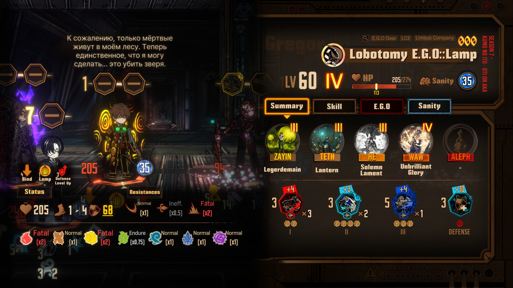
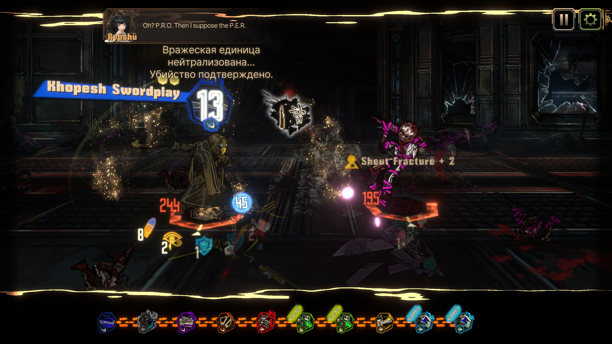
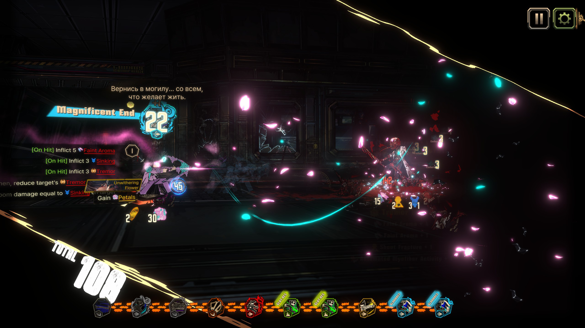
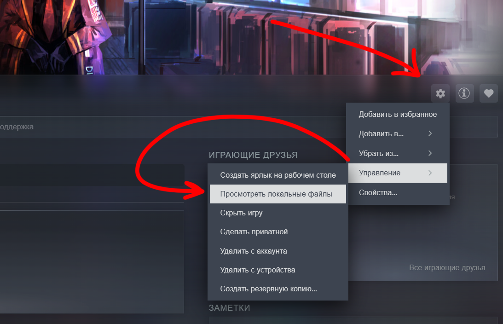
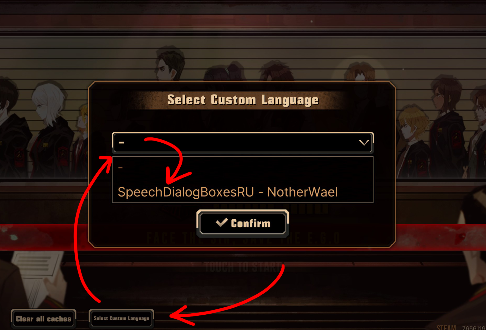

# Русский перевод боевых диалоговых окон Limbus Company. Версия v1.101.0, LCE Check-up Event

## Перевод может содержать ошибки.
### ВАЖНО
- Основной Английский перевод может содержать различные ошибки. Ввиду этого, ошибки с английского перевода могли перейти и на русский
- На данный момент перевод на русский выполнен с помощью DeepSeek. Постепенно буду исправлять все ошибки перевода
- Некоторые пункты удалены из описания. Если у вас возникли проблемы, прежде чем написать о проблеме в Issues, ознакомьтесь с описанием основного репозитория модификации.

## Предупреждение об установке
### Обновлять игру НЕ нужно при каждом новом обновлении локализованного контента. Обновление требуется ТОЛЬКО при появлении новых идентичностей, чтобы добавить к ним реплики (а также для новых сюжетных врагов, поскольку у них может не быть реплик к моменту выхода игры, так как это обновление заменяет файл с репликами).

### Некоторые пользователи столкнулись с проблемами, когда язык их системы не был установлен на английский. Это может вызвать ошибки в игре, подобные этим:  [Issues](https://www.youtube.com/watch?v=nHrCFfdBMAA)

# Установка - ПК

## Классический метод:
1. Нажмите **Code** → **Download ZIP** в этом репозитории GitHub.
2. Откройте или Распакуйте ZIP файл.
3. Нажмите 'Просмотреть локальные файлы' Limbus Company, и откройте папку 'LimbusCompany_Data'
Прим.`C:\Program Files (x86)\Steam\steamapps\common\Limbus Company\LimbusCompany_Data`
      
      

4. Перетащите папку "Lang" из скачанного ZIP файла в папку "LimbusCompany_Data".
      
- Что бы обновить, Удалите файл `BattleSpeechBubbleDlg.json`по пути `Lang\SpeechDialogBoxesEN - NotherWael\`, и затем поместите туда новую версию файла.
- Чтобы отключить этот мод, просто удалите папку `SpeechDialogBoxesEN - NotherWael` и перезапустите игру, или выберите «-» в разделе «Выбор пользовательского языка» в главном меню и перезапустите игру.
## Настройка запуска:
1.Запустите игру, нажмите "Select Custom Language," в левом низу экрана, выберите **SpeechDialogBoxesEN - NotherWael**, и перезапустите игру.  
   - Если этот параметр уже выбран, вы можете пропустить этот шаг.
   
2. Наслаждайтесь модом!

## С помощью установщика: 
### ВАЖНО: я никак не изменял установшик. При его использовании у вас будет установлена оригинальная английская версия мода от NotherWael. Используйте классический метод установки

Сообщайте о любых ошибках, возникших при использовании установщика!
1. Скачайте [LimbusSpeechBubbleENInstaller.exe](https://github.com/NotherWael/LimbusDialogueBoxes_EN/raw/refs/heads/main/LimbusSpeechBubbleENInstaller.exe) откройте его.
2. Установщик должен автоматически обнаружить папку с игрой, но если этого не произошло, Вам нужно открыть папку с игрой, и выбрать папку `LimbusCompany_Data`.
3. Нажмите на [Install / Update Mod]
4. Мод должен быть установлен и обновлён до последней версии!
5. Так же с помощью установщика вы можете с лёгкостью обновить мод вместо того, что бы заново скачивать мод с репозитория GitHub.

##  ̶У̶с̶т̶а̶н̶о̶в̶к̶а̶ ̶н̶а̶ ̶Т̶е̶л̶е̶ф̶о̶н̶ ̶(̶A̶N̶D̶R̶O̶I̶D̶ ̶O̶N̶L̶Y̶)̶  
### ВАЖНО: этот метод НАПРЯМУЮ заменяет файлы игры из за того что функция кастомных переводов не поддерживается на телефоне. Не рекомендую использовать данный метод, т.к. файл нужно менять при каждом запуске игры, и самое главное, за модификацию файлов игры можно получить блокировку аккаунта.
### Если вы всё же решились заменять файлы игры, посмотрите руководство по установке в основном репозитории NotherWael

## Инструкция по установке пользовательских шрифтов (не все поддерживают русский язык)
1. Нажмите **Code** → **Download ZIP** в этом репозитории GitHub.
2. Откройте или Распакуйте ZIP файл.
3. Нажмите 'Просмотреть локальные файлы' Limbus Company, и откройте папку 'LimbusCompany_Data'
4. Откройте папку 'Lang', а затем папку 'SpeechDialogBoxesEN - NotherWael'.
5. Удалите папку 'Font'.
6. Из ZIP-файла откройте папку 'Custom Fonts' и выберите стиль.

7. Откройте папку с выбранным стилем и скопируйте папку 'Font'.
8. Вставьте папку 'Font' в папку 'SpeechDialogBoxesEN - NotherWael'.
9. Готово! И перезапустите игру, если она открыта.

## Q&A
1. Это безопасно? За это можно получить бан?
   - Это безопасно и не влечет за собой бан. Это пользовательский языковой мод, реализованный PM, он просто изменяет файлы локализации.
   - Project Moon заявили: «Обратите внимание, что модификация игрового клиента, выходящая за рамки языковых текстовых файлов, такая как изменение изображений клиента или внутриигровых данных, может повлечь за собой юридические последствия или бан без предварительного предупреждения» [Ссылка на уведомление] (https://store.steampowered.com/news/app/1973530/view/533220039674824558)
